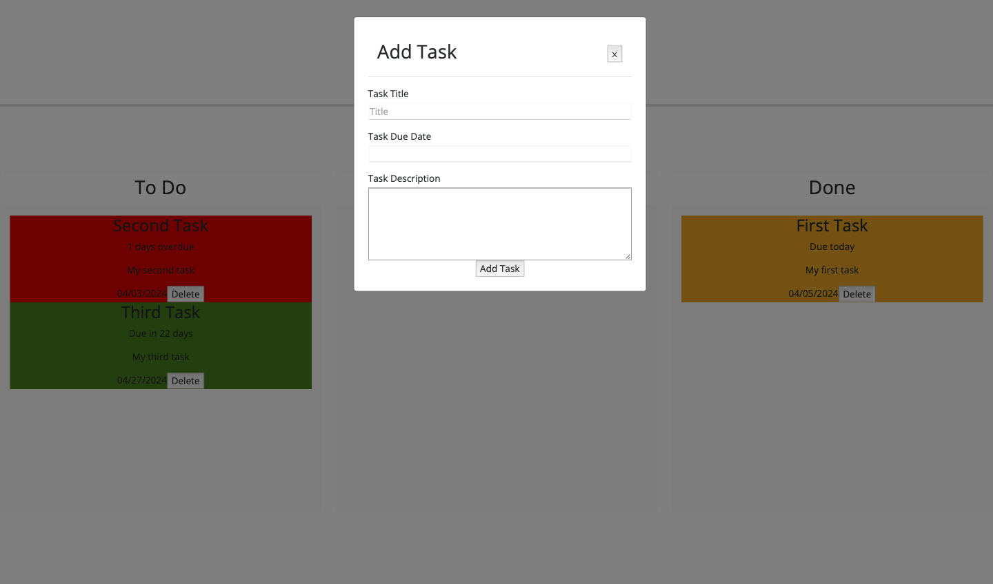

# Project Management Task Board

## Description

This project is a task management tool with drag and drop features to manage deadlines.

## Usage

Add task information to the task Modal. Drag and drop tasks between columns as the completion status changes. Delete the tasks after completed.
Provide instructions and examples for use. Include screenshots as needed.

This is the link to the deployed webpage: https://anullator.github.io/Project-Management-Task-Board/

## Credits

Received Starter Code from RICE Fullstack Bootcamp. First commit is starter code.

## Features

- JQuery
- Day.JS
